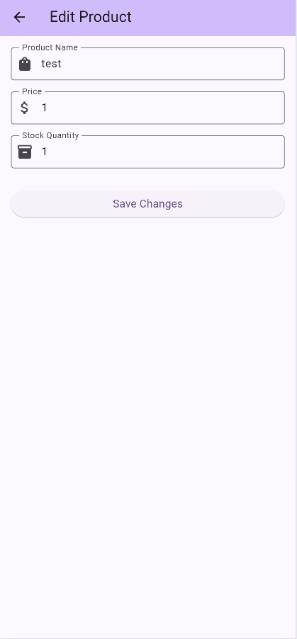

# Tonaire Test Project

This repository was developed for Tonaire Digital test. It consists of a Node.js/Express backend API and a Flutter mobile application frontend.




## Project Structure

- `backend/tonaire-app/`: Express.js REST API with MVC architecture
- `frontend/tonaire/`: Flutter mobile application
- `sql/`: Database schema and sample data

## Setup and Running Instructions

### Backend Setup

1. Navigate to the backend directory:
   ```bash
   cd backend/tonaire-app
   ```

2. Install dependencies:
   ```bash
   npm install
   ```

3. Set up environment variables:
   - Copy the `.env.example` file to `.env`
   ```bash
   cp .env.example .env
   ```
   - Open the `.env` file and update with your database credentials
   ```
   PORT=3000
   DB_HOST=localhost
   DB_USER=your_username
   DB_PASSWORD=your_password
   DB_NAME=your_database_name
   NODE_ENV=development
   ```

4. Start the backend server:
   ```bash
   npm start
   ```
   The API will be available at http://localhost:3000

### Frontend Setup

1. Make sure you have Flutter installed. If not, follow the [official Flutter installation guide](https://docs.flutter.dev/get-started/install).

2. Navigate to the Flutter app directory:
   ```bash
   cd frontend/tonaire
   ```

3. Install Flutter dependencies:
   ```bash
   flutter pub get
   ```

4. Run the Flutter app:
   ```bash
   flutter run
   ```


## API Endpoints

The following endpoints are available in the backend:

- `GET /api/products`: Get all products
- `GET /api/products/:id`: Get product by ID
- `POST /api/products`: Create a new product
  - Required fields: `productName`, `price`, `stock`
  - Example request body:
    ```json
    {
      "productName": "New Product",
      "price": 99.99,
      "stock": 100
    }
    ```
- `PUT /api/products/:id`: Update product by ID
  - Required fields: `productName`, `price`, `stock`
- `DELETE /api/products/:id`: Delete product by ID

## Troubleshooting

### Backend Issues

- Ensure your database server is running
- Check that the `.env` file has correct database credentials
- Verify port 3000 is not in use by another application

### Frontend Issues

- Ensure the backend server is running
- Verify the API base URL in the Flutter app matches the backend URL
- Run `flutter clean` followed by `flutter pub get` if you encounter build issues

## Development

This project follows an MVC pattern in the backend with the following structure:

- `models/`: Database schemas and data models
- `controllers/`: Business logic for handling requests
- `routes/`: API endpoint definitions
- `config/`: Configuration files for database, etc.
- `middleware/`: Express middleware functions

## Database Setup

1. Create a SQL Server database named `example_db_name` (or use the name specified in your `.env` file)

2. Import the SQL schema and sample data:
   - The SQL script is located in the `sql/schema.sql` file

### Database Connection

The backend application connects to the SQL Server database using the mssql package. The connection is configured in `backend/tonaire-app/config/database.js` and uses the environment variables from your `.env` file.

The application is designed to work with a SQL Server database using the following table structure:

```sql
CREATE TABLE PRODUCTS (
    PRODUCTID INT PRIMARY KEY IDENTITY(1,1),
    PRODUCTNAME NVARCHAR(100) NOT NULL,
    PRICE DECIMAL(10, 2) NOT NULL,
    STOCK INT NOT NULL
);
```

When the application starts, it automatically:
1. Connects to the specified database
2. Creates the PRODUCTS table if it doesn't exist
3. Makes the API endpoints available for product management
